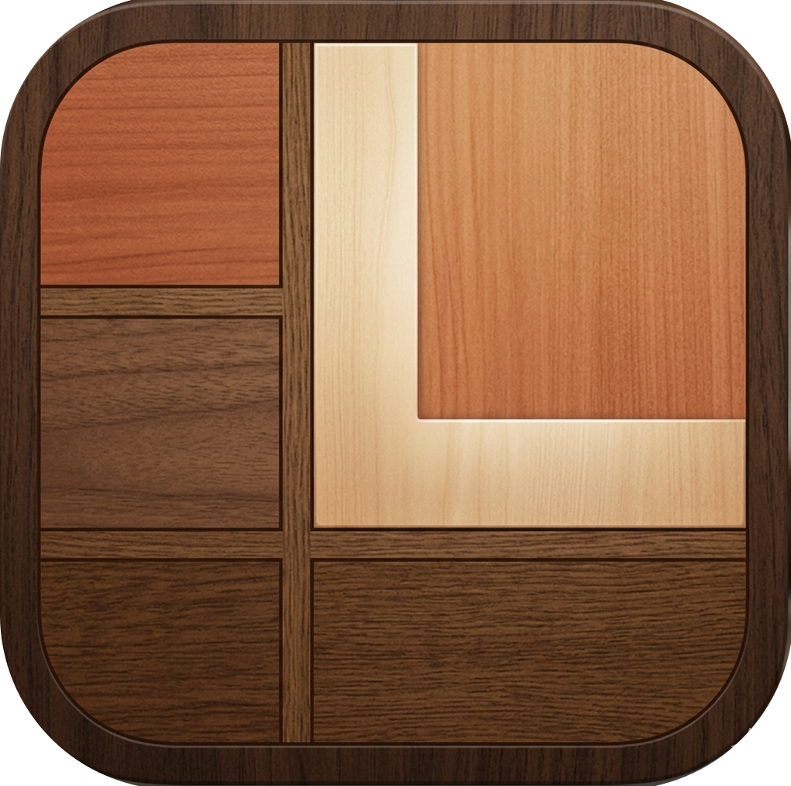
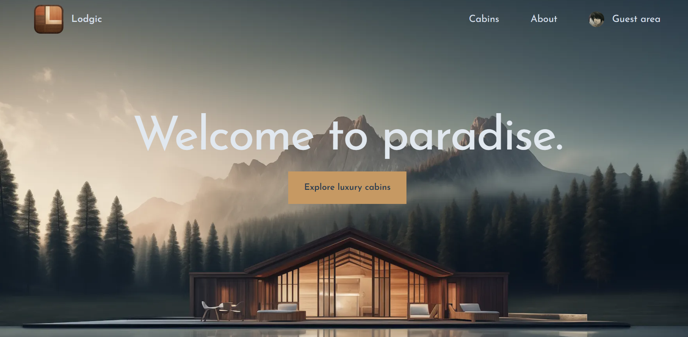

  

  <h1>Lodgic</h1>

  <h3>
    <a href="https://lodgic-customer.vercel.app/">
      <strong>Live Site</strong>
    </a>
  </h3>

  

        <a href="https://lodgic-customer.vercel.app/">View website</a>
        •
        <a href="https://github.com/amankushwahacodes/lodgic-customer">Report Bug</a>
        •
        <a href="https://github.com/amankushwahacodes/lodgic-customer/pulls">Request Feature</a>
  

  

<!-- Badges -->

<!-- Brief -->

<b> Lodgic </b> is a full-stack cabin booking platform built with Next.js that allows users to explore cabins, check availability, and manage reservations through a seamless booking experience. It provides secure authentication, dynamic booking management, and a responsive interface optimized for modern web experiences.

<!-- Screenshot -->

## Authentication & User Management
- Secure Google authentication allows users to sign in and manage their bookings
- Personalized guest profile management with account details and reservation history
- Protected routes ensure only authenticated users can access reservation features

## Reservations & Booking Experience
- Users can browse cabins with detailed information and availability
- Dynamic date range selection for booking stays
- Reservation system calculates stay duration and pricing automatically
- Guests can create, update, and manage their bookings seamlessly

## Core Features

- **Cabin Exploration**
  - Browse available cabins with descriptions, images, pricing, and guest capacity

- **Filtering System**
  - Filter cabins based on guest capacity for easier navigation

- **Reservation Management**
  - Create, edit, and manage reservations with real-time updates

- **Google Authentication**
  - Secure login flow with protected user-specific features

- **Responsive Design**
  - Fully responsive experience optimized for desktop and mobile devices

## Tech Stack

- **Frontend:** Next.js (App Router), React
- **Styling:** Tailwind CSS
- **Authentication:** Auth.js / NextAuth with Google OAuth
- **Database & Backend:** Supabase
- **Deployment:** Vercel
## Engineering Highlights

- Built using Next.js App Router with Server Components and Client Components
- Implemented secure Google authentication and protected routes
- Used Server Actions for handling reservations and user interactions
- Applied URL-based filtering using search parameters
- Optimized performance through server-side rendering and data fetching patterns
- Designed reusable components with a scalable project structure

## Live Demo

🔗 [Visit Application](https://lodgic-customer.vercel.app/)

## Test Credentials

- Login through Google authentication

## Author

<b>👤 Aman Kushwaha</b>

- LinkedIn - [@amankushwahacodes](https://www.linkedin.com/in/amankushwahacodes)
- GitHub - [@amankushwahacodes](https://github.com/amankushwahacodes)

Feel free to contact me with any questions or feedback!
